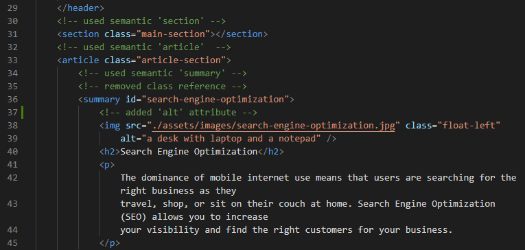
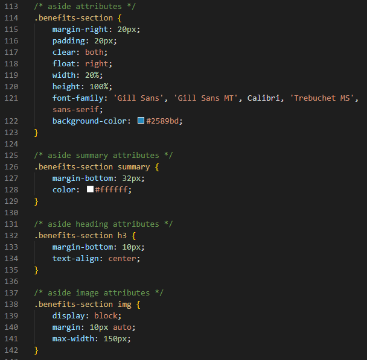
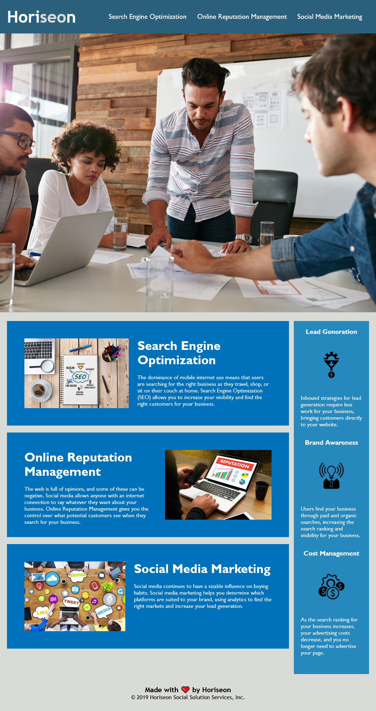

# Horiseon Refactor

## Description 

Hello and welcome to my project that aims to showcase my ability in refactoring code. 
Horiseon, a fictional marketing company, wants to bring their codebase to accessibility standards for search engine optimization.

Issues with their starter code include:

- generic title

- a non-functioning link

- no image alt text

- non-descriptive div elements

- non-sequential heading order

My solutions include:

- concise, descriptive title

- all links functioning

- accessible alt attributes 

- semantic HTML elements

- logical element structure

- sequential heading order

For code readability, I include:

- consolidated CSS selectors and properties

- CSS commenting

The website's appearance remains the same:

Feel free to check out the [deployed website](https://zzzorigtbaatar.github.io/Horiseon-Refactor/) as well as the [repository](https://github.com/zzzorigtbaatar/Horiseon-Refactor).

In order to do this project, I learned and used HTML, CSS, git, and github.

## Credits

* Jerome Chenette, UC Berkeley Extension Coding BootCamp

* https://www.w3schools.com/html/html5_semantic_elements.asp

## License

[LICENSE](/LICENSE)

---

https://www.linkedin.com/in/zorizulkhuu/